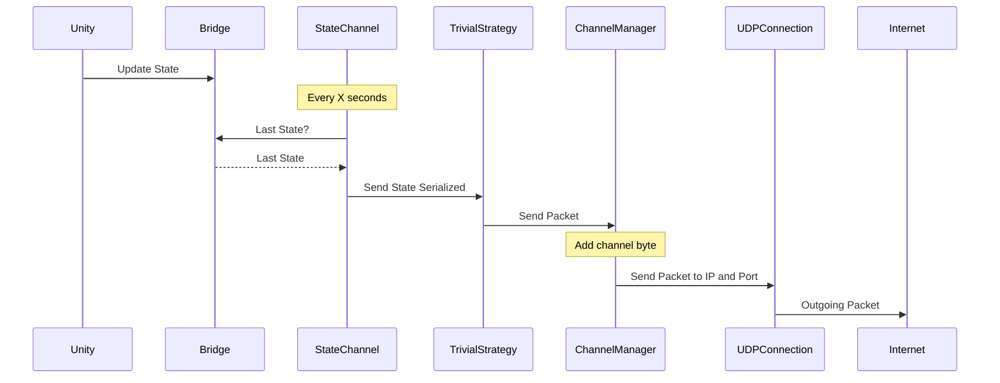
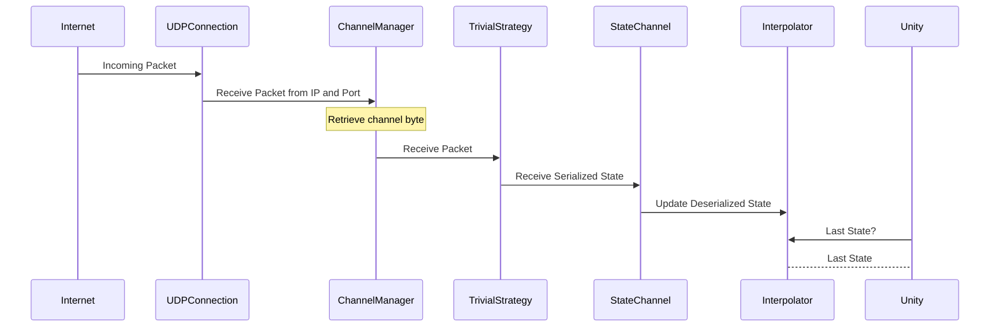
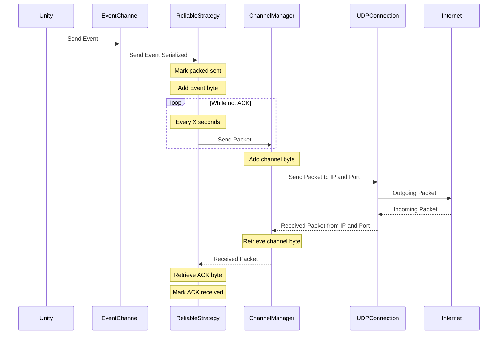
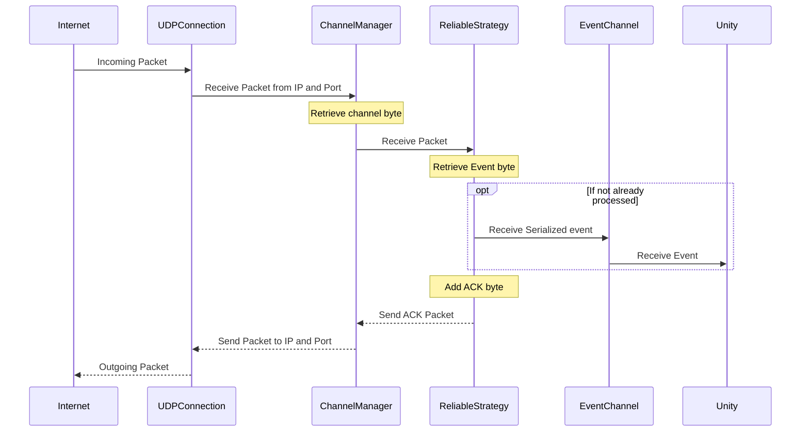

Para ver Graficos abrir con stackedit.io/app

## Componentes

### Unity Provider
- Se encarga de generar la información a ser enviada
### Unity Receiver
- Se encarga de representar la información recibida en Unity

### Channel

-   Representa un tipo de información específica
-   Sabe serializar y deserializar dicha información.
-   Utiliza un bitbuffer para comprimir y descomprimir la data.
-  Puede ser de tipo StateChannel o EventChannel
	-	#### StateChannel
		* Posee un frecuencia de envío del snapshot
		* Posee un bridge contra el unity provider
		* Posee un interpolator contra el unity receiver
		* Cada Snapshot sabe interpolarse
		* Cada Snapshot posee un timestamp para ser interpolado
	-	#### EventChannel
		* Se envía cuando se emite un evento
		* Se encolan y se resuelven contra el unity receiver

### SenderStrategy

-   Determina las reglas a utilizar cuando se mandan y se reciben paquetes.
	-  	 **ReliableStrategy** para enviar paquetes reliable con timeout.
	-   **TrivialStrategy** para enviar paquetes unreliable.

### ChannelManager

-   Administra los paquetes entrantes y los asigna al **Channel** especifico.
-   Administra los paquetes salientes y los etiqueta en base al **Channel** de donde vino.

### Connection Manager

-   Maneja conexiones. Una conexión es una tupla IP-Puerto
-   El server Connection Manager contiene una colección de ChannelManagers para cada cliente
-   El client Connection Manager tiene solo un Channel manager.

### UDPConnection

-   Implementado sobre udp. Solo envía y recibe paquetes.
-   No maneja conexiones, sólo las Acepta.

## Ejemplos Concretos

### State Channel con TrivialStrategy
Se utiliza para:
	-Posicion de la granada.
	-Estado de los otros jugadores.
	-Estado del jugador actual.
	

###  EventChannel con ReliableStrategy
Se utiliza para:
	-Respawn, muerte, tirar granada y disparar de los jugadores.
	-Keep Alive.
	-Inputs del jugador (Con Trivial strategy, Reliable repitiéndolos en cada paquete).

