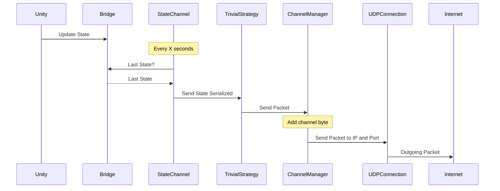
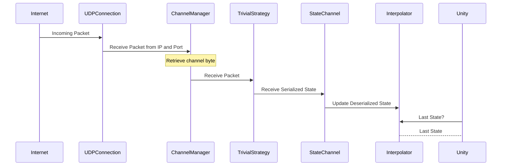
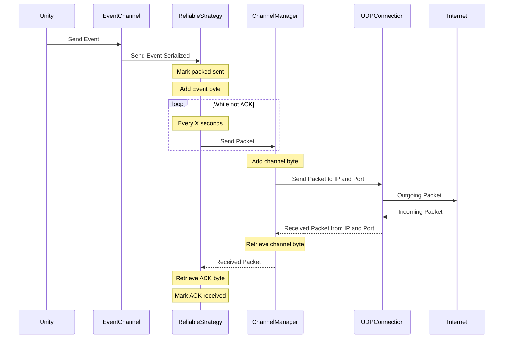
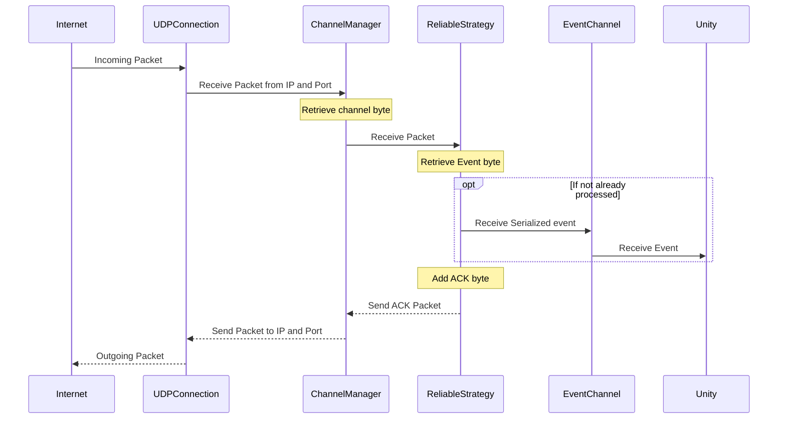

```mermaid
sequenceDiagram
Unity ->> Bridge: Update State
Note over StateChannel: Every X seconds
StateChannel ->> Bridge: Last State?
Bridge -->> StateChannel : Last State
StateChannel ->> TrivialStrategy: Send State Serialized
TrivialStrategy ->> ChannelManager: Send Packet
Note over ChannelManager: Add channel byte
ChannelManager ->> UDPConnection: Send Packet to IP and Port
UDPConnection ->> Internet: Outgoing Packet
```

```mermaid
sequenceDiagram
Internet ->> UDPConnection: Incoming Packet
UDPConnection->>ChannelManager: Receive Packet from IP and Port
Note over ChannelManager: Retrieve channel byte
ChannelManager ->> TrivialStrategy: Receive Packet
TrivialStrategy ->> StateChannel: Receive Serialized State
StateChannel ->> Interpolator: Update Deserialized State
Unity ->> Interpolator: Last State?
Interpolator --> Unity: Last State
```

```mermaid
sequenceDiagram
Unity ->> EventChannel: Send Event
EventChannel ->> ReliableStrategy: Send Event Serialized
Note over ReliableStrategy: Mark packed sent
Note over ReliableStrategy: Add Event byte
loop While not ACK
	Note over ReliableStrategy: Every X seconds
	ReliableStrategy ->> ChannelManager: Send Packet
end
Note over ChannelManager: Add channel byte
ChannelManager ->> UDPConnection: Send Packet to IP and Port
UDPConnection ->> Internet: Outgoing Packet
Internet -->> UDPConnection: Incoming Packet
UDPConnection -->> ChannelManager: Received Packet from IP and Port
Note over ChannelManager: Retrieve channel byte
ChannelManager -->> ReliableStrategy: Received Packet
Note over ReliableStrategy: Retrieve ACK byte
Note over ReliableStrategy: Mark ACK received
```

```mermaid
sequenceDiagram
Internet ->> UDPConnection: Incoming Packet
UDPConnection->>ChannelManager: Receive Packet from IP and Port
Note over ChannelManager: Retrieve channel byte
ChannelManager ->> ReliableStrategy: Receive Packet
Note over ReliableStrategy: Retrieve Event byte
opt If not already processed
	ReliableStrategy ->> EventChannel: Receive Serialized event
	EventChannel ->> Unity: Receive Event
end
Note over ReliableStrategy: Add ACK byte
ReliableStrategy -->> ChannelManager: Send ACK Packet
ChannelManager -->> UDPConnection: Send Packet to IP and Port
UDPConnection -->> Internet: Outgoing Packet
```
